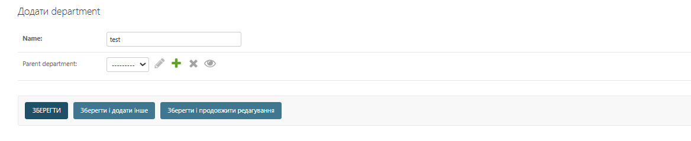
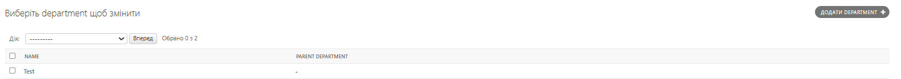

# Завдання

## Завдання 1
Додайте поле `logo` до моделі `Company`, яке дозволятиме завантажувати логотипи компанії. Потім відобразіть цей логотип на головній сторінці. Якщо логотип відсутній, слід використовувати запасний варіант логотипу з папки `static`, як це зроблено в `home.html`.

---

## Завдання 2
Імплементуйте кешування для відображення даних у додатку.

---

## Завдання 3
Інтегруйте систему повідомлень для оповіщення користувачів про успішні чи невдалі операції зі зміною інформації про робітників. Додайте скріншот з повідомленням.

---

## Завдання 4
Налаштуйте сигнал `pre_save` для моделі `Department`, який автоматично конвертує першу літеру назви департаменту у верхній регістр.

