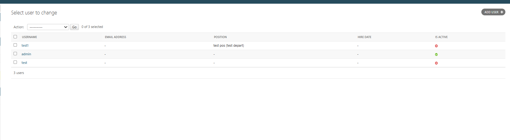
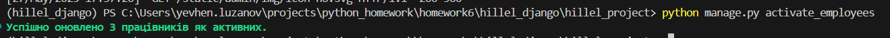
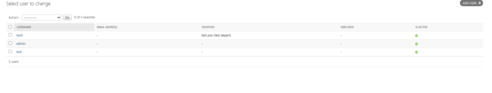
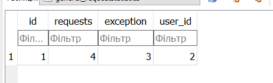

## Завдання 2: Створення Management Команди

Створіть нову management команду для моделі `Employee`. Команда повинна робити всіх `Employee` активними (`is_active=True`).

---

## Завдання 1: Додати до Middleware обробку виключень

Доповніть ваш клас `RequestStatisticsMiddleware` методом `process_exception()`. Цей метод повинен інкрементувати поле `exception` в моделі `RequestStatistics` кожного разу, коли відбувається виключення.
git
